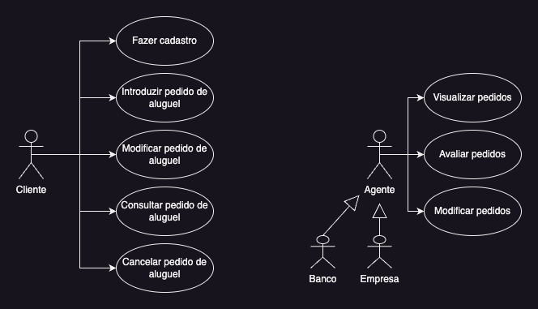
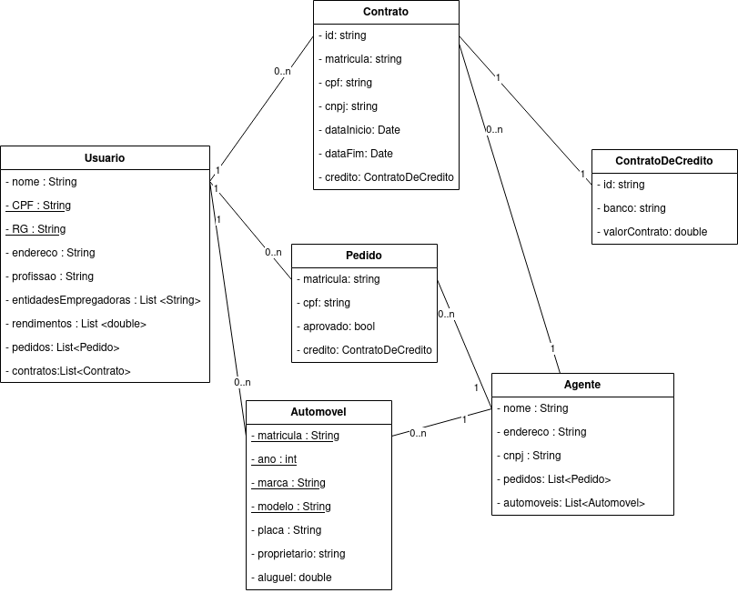

# Descrição do projeto
O sistema só pode ser utilizado após cadastro prévio.

Os usuários individuais (clientes) podem introduzir, modificar, consultar e cancelar pedidos de aluguel. Por outro lado, os agentes (empresas e bancos) podem modificar e avaliar pedidos.

Após introdução no sistema, os pedidos são analisados do ponto de vista financeiro pelos agentes e, em caso de parecer positivo, são colocados à sua consideração para execução do contrato.

Sobre os contratantes do aluguel, armazenam-se os dados de identificação (RG, CPF, Nome, Endereço), profissão, as entidades empregadoras e os respectivos rendimentos auferidos (máximo 3).

Dependendo do tipo de contrato, os automóveis alugados podem ser registrados como propriedade dos clientes, empresas ou bancos.

Sobre os automóveis, o sistema registra a matrícula, ano, marca, modelo e placa.

O aluguel de um automóvel pode estar associado com um contrato de crédito, o qual foi concedido por um dos bancos agentes. 

Em termos do sistema, o servidor central encontra-se ligado aos computadores locais dos clientes e aos diversos agentes aderentes através da Internet.

O sistema pode ser subdividido em dois subsistemas: um para gestão de pedidos e contratos; e outro para a construção dinâmica das páginas web.

# Artefatos do projeto

### Diagrama de Caso de Uso

### Histórias de Usuário
[Acesse](./historias_usuario.md)

### Diagrama de Classes

### Diagrama de Pacotes (Visão Lógica)
